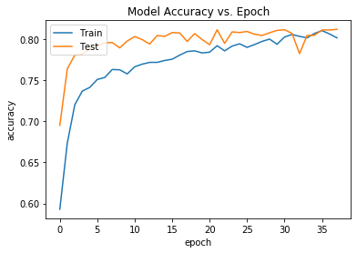
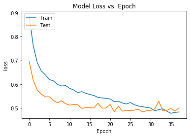
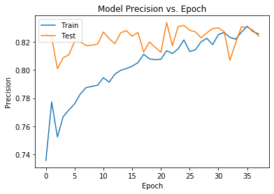
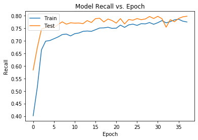

# An LSTM-Based Sentiment Classifier Built in Keras and Trained on Kaggle Twitter Airline Sentiment Data 
  
The goal was to build a classifier that could identify the overall sentiment of user input, such that each string received one of three possible mutually-exclusive labels: 'positive', 'negative', or 'neutral'. The task was thus framed as a three-class classification problem, in which each model output consisted of likelihood scores for each class. Targets associated with the highest of class scores were then assigned. A regression approach could also have been used; rather than yield a prediction likelihood for each class, the model in that case would have presented a number between -1.0 and 1.0 for each input datum. A target value closer to the negative value would have been labeled 'negative' (after some determined threshold), and those closer to the positive would have been labeled 'positive'. Those nearer to zero would have been determined to be neutral. Both approaches are valid and ideally would find similar results. 

In order to boost accuracy and reduce  computational resources, I opted to use a pre-trained set of word vectors trained on a very large corpus of Twitter data. GloVe is a an unsupervised solution derived from the distributional hypothesis, which states that “words which are similar in meaning occur in similar contexts.” (Herbert Rubenstein and John B. Goodenough. 1965.
Contextual Correlates of Synonymy. Communications of the ACM (October 1965), https://doi.org/10.1145/365628.365657). 

## Getting Started
The model was built in Python v. 3.7.6 and Anaconda 4.8.3. Anaconda is a powerful scientific computing platform which includes its own package and environment manager. To get Anaconda, visit the official downloads page: 

https://docs.anaconda.com/anaconda/install/

## Dependencies
The GloVe and Kaggle data will need to be downloaded from their respective sites and placed within a subdirectory named Data. 

GloVe: Global Vectors for Word Representation 
This model utilizes the 50d Twitter set found here: 
https://nlp.stanford.edu/projects/glove/

The Twitter U.S. Airline Sentiment dataset from Kaggle
Dimensions: 14640 examples by 15 features. Sentiment is 63% negative, 21% neutral, 16% positive.*

https://www.kaggle.com/crowdflower/twitter-airline-sentiment

As outlined below, such class skew can be problematic, and I hope to address this in future iterations of this project. 

Tensorflow (including Keras):  
https://www.tensorflow.org/install/pip
```
! conda install tensorflow
```

NumPy:

https://docs.scipy.org/doc/numpy/user/install.html
```
! conda install numpy
```
Matplotlib (for visualizations): 
https://matplotlib.org/users/installing.html
```
! conda install matplotlib
```

Download the repo and run get_glove_model.py to build glove_model.npy and avg_vec.npy. Once these files are written, run run_me.py. I will adapt project structure to automatically call get_glove_model.py from within run_me.py, going forward. 

An overview of each module: 

### RNN.py: Build and Train Model
By default, model architecture is Sequential, with two LSTM layers, and a topmost Dense layer. Editable attributes include Dense activation, number of hidden units, and Dropout regularization. Hyperparameters such as batch size, maximum allowable epochs, and early stopping characteristics can also be tweaked here. Output is a model.h5 model file which can be called directly, without need for repetitive retraining. RNN also includes performance evaluation and matplotlib visualizations of accuracy and loss.  

### run_me.py: Load .h5 Model File and Present Interactive Interface
Loads model and provides a command line for users to input sentences, which will then be judged for their sentiment. Predictions will be graded with a likelihood score. 

### glove_data.py: Builds Test and Train Datasets
First constructs a 3D array containing word vectors for every token included in every Tweet in the dataset. 

### process_text.py: Cleans Tweet Data
Includes regex expressions to lowercase, tokenize, and format Tweet data. Removes URLs, @mentions, and other junk punctuation. Does not remove stopwords, which was intentional, but may add this optional functionality later. Returns a list of lists. 

### get_glove_model.py: Load GloVe Pre-trained Word Vectors
Output is a dictionary called gloveModel, wherein keys are vocabulary tokens (strings) and values consist of pre-trained word vectors (Numpy arrays of length 50). Vector lengths greater than and less than 50 can be chosen instead on the Kaggle website. 
The separateness of this module from glove_data.py precludes the need to load the GloVe dictionary with every model run. 

### get_inputs.py: Creates a Dataset Object 
Builds a structured Tweets dataset, including cleaned data and one-hot-encoded labels. 

## Results

With early stopping, training ceased after 37 epochs and yielded the following success metrics: 

accuracy: 0.81831
recall: 0.80704
precision: 0.82999

```
batch_size = ~64
num_epochs = ~35
LSTM units = ~32 # 15 to 30 between two or more layers; higher numbers provoked overfitting
Dropout = ~0.20
``` 






## Future Tasks
Model accuracy averaged around 75-85% on training and testing data, with various parameters. 
While this is in range of acceptable, improvements could be made by further exploring:  

* Use of a dataset covering a larger domain, i.e. representing a greater percentage of words used in everyday English. Because this set deals primarily in language about airlines in the United States, it does not generalize well to other arenas.
* Use of a dataset with higher cohesion. Excerpts from iterary sources, for example, would include fewer typographical errors, "slang" words, emojis, and other irregularities that can confuse learning. 
* Use of a dataset without skew between classes; or, because some discrepancy is nearly inevitable, better manipulation of data to account for class imbalance. 
* More extensive data cleansing to accomodate a higher percentage of missing words, as well as digits and other outliers not addressed. 

Future iterations could attempt to implement an RNN "from scratch" - that is, without the use of APIs, though this may be an infeasible task (the try is half the adventure). LSTM has garnered wide preference over naive ANNs, CNNs, and generic RNNs for sentiment analysis, though lately their cousin, the transformer, has gained popularity. 